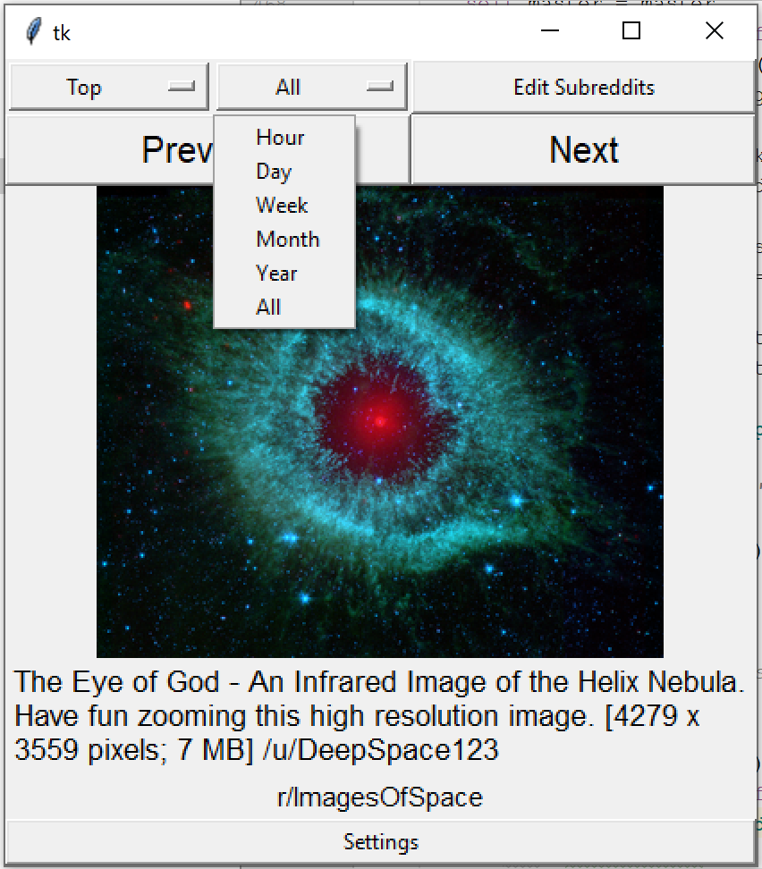
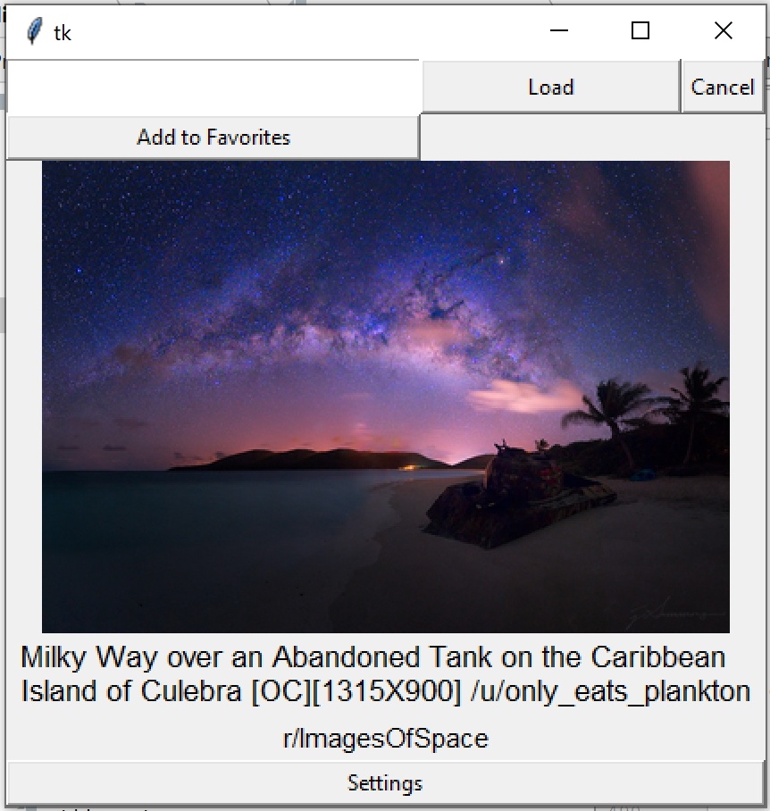

# Reddit-Image-Viewer
An application I made using python Tkinter to pull images from subreddits to browse. I created this in 2018, before I had taken programming classes.

It allows you to enter a single or multiple subreddits, and it will pull the images from those subreddits, and allows you to view them one at a time. 

It also allows you to change settings which are saved in a file, as well as create and save groups of subreddits.

Required Packages:
-
- Tkinter
- Praw
- PIL
- Requests

Also requires a file `Reddit account info.txt` which contains the following information for the Praw api (in order):
- Reddit Username
- Reddit Password
- Reddit Client Id
- Reddit Client Secret
- Reddit User Agent

